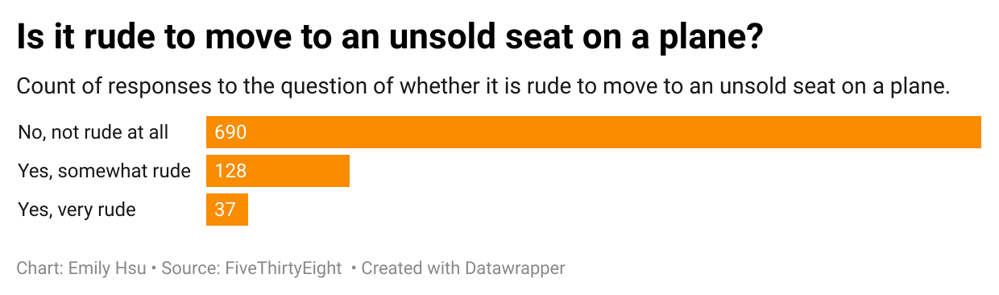

# emily-week4-repository
I picked the question of "is it rude to move to an unsold seat on a plane?" because this is something I have been thinking about ever since a few of the recent flights I have been on. A few flights ago, someone I was traveling with moved to another seat in the row in front of us that was empty thinking it was no issue at all. However, they were lightly reprimanded by the flight attendant but allowed to stay. On subsequent flights, I have seen other passengers do the same, although they are only sometimes told to move back. So, I wanted to see what others thought. My chart shows that the majortiy (690) of respondents say it is not due, followed by 128 respondents saying it is somewhat rude, and then 37 respondents saying it is very rude. This reveals that most people think it is not rude, with a smaller minority believing it is only a little rude, and a small minority of people finding it very rude.

